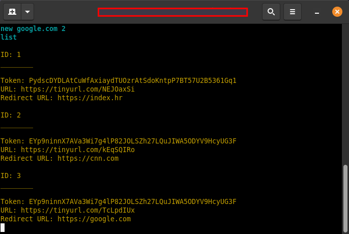
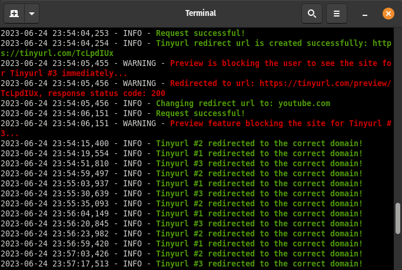

## Tinyurl Adapter

## Overview
#### This python package enables you to generate and control many tinyurl links with domain 'tinyurl.com' and with randomly generated 8-character alias that goes after domain, e.g : tinyurl.com/4kj95b25

With this python package you are able to generate and control many tinyurl instances, update their redirect at your will.
One reason why you would want to use update command in cli is because tinyurl ***sometimes randomly adds a tinyurl/preview***
page on your tinyurl link, so with update to the resource it ***disappears*** after some attempts

This python module handles common errors for given functions so you don't need to worry about script throwing an
unhandled exception and terminating. Just don't test the cli too much. Also don't create more tinyurl instances
 then your machine can handle :)

You can view realtime logs in new gnome-terminal that's automatically opened so make sure you do ```apt install gnome-terminal```

Configure tokens / auto-redirects however you want in ***settings.py***

***create_redirect_url()*** - connects to tinyurl api and creates new tinyurl redirect to your given url

***update_redirect()*** - updates your redirect url in case of host failure, done via cli

***check_status()*** - it periodically checks validity of redirect each tinyurl instance
                 by sending http request with User-Agent: Google Chrome

### CLI COMMANDS

 Once you run the script you will have a cli which has following functionality:

***new [url] [token_index]***- Create new tinyurl instance that redirects to <url>, <token_index> is ***optional***

***select [id]*** - select tinyurl instance by their id. Useful to manually update redirect. Use 'list' to see all instances.

***update [url]*** - updates redirect url of selected tinyurl instance

***current*** - display information about current tinyurl instance and client info

***list*** - list all created tinyurl instances

***exit*** - terminate the program, logs are saved in {home_dir}/.logs/logfile.log'
### CLI interface

### Logo reader terminal


If you have any questions, feel free to contact me